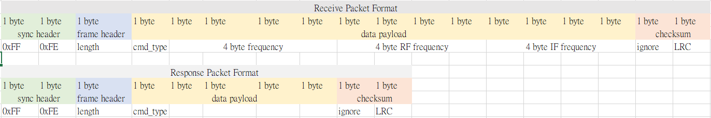
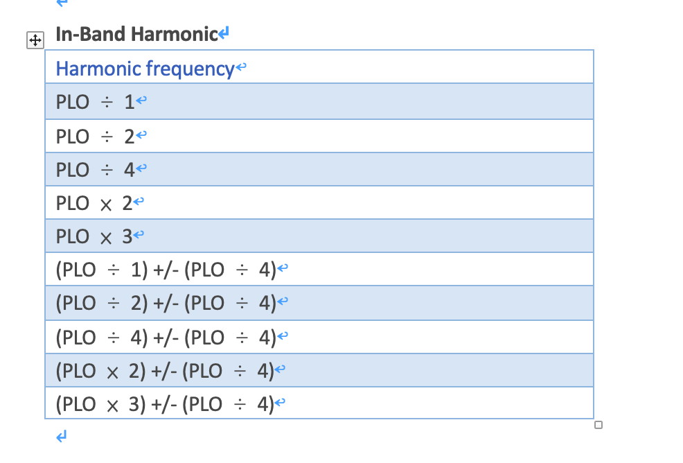

# UART Packet Format of TMYTEK UD Box



Tx packets follows the format showed above.The TX packet length is 10 bytes.

Rx packets follows the format showed above.The RX packet length is 18 bytes.

## Length
The length is counting from frame header to checksum.

## RX Cmd type

## 0x00
The packet response from UD Box to denote UD recived “correct” command format.

## 0x01
### Function: Set frequency in kHz resolution
### Data payload
* Low byte of UDBox frequency in kHz
* Mid byte of UDBox frequency in kHz
* High byte of UDBox frequency in kHz
* Highest byte of UDBox frequency in kHz

## 0x02
### Function: Set default frequency in kHz resolution
### Data payload
* Low byte of UDBox frequency in kHz
* Mid byte of UDBox frequency in kHz
* High byte of UDBox frequency in kHz
* Highest byte of UDBox frequency in kHz

# Sample UART control for UDBOX

* UDBox frequency : 16 GHz (0x00F42400)
* RF frequency : 18.2 GHz (0x0115B5C0)
* IF frequency : 22.1 GHz (0x01513820)

1. Coolterm download https://coolterm.en.lo4d.com/windows
2. Connect with UART
3. coolterm > connection > send string > Hex
4. Send hex UART cmd : 
FF FE 10 02 00 24 F4 00 C0 B5 15 01 20 38 51 01 00 A1
5. coolterm > view hex
6. Receive hex UART cmd :
FF FE 08 00 00 00 00 00 00 F8
7. Check the settings by spectrum analyzer.

## Return response type in response[3]

### 0x00
The packet returned from UD Box to denote OK

### 0x01
The packet returned from UD Box to denote warning or RF - IF != UDBOX LO

### 0xFF
The packet returned from UD Box to denote:
1. UD recived ”incorrect“ command format or cmd set failed.
2. Harmonic frequency triggered.

## LRC
For every Tx pakcet user needs to prepare LRC checksum before sending the command to UD Box.
The LRC is generated by frame header and data payload only.

## Avoid harmonic frequency
* UDBox frequency , RF , IF settings will cause harmonic frequency problem by following situation


## UDBOX settings when harmonic frequency happens
* Set UDfrequency as 1.925 GHz
* UART response cmd at the fourth byte with error code 0xFF 


pseudo code for cmd checksum

```
uint8_t LRC(uint8_t *msgPtr, uint8_t len)
{
  uint8_t mLRC = 0;
  for each element in msgPtr
  {
    mLRC += each element in msgPtr
  }
  return ((uint8_t)(-((uint8_t)mLRC))); // two's complement
}
```
